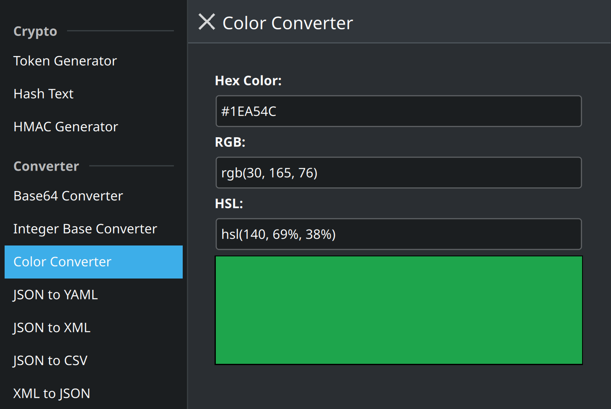

# Tools

A Kirigami-based developer utility suite, providing a set of handy tools in a convergent, cross-platform interface, inspired by [IT-Tools](https://github.com/CorentinTh/it-tools).



## Tools Included

- **Crypto**: Token Generator, Hash Text, HMAC Generator
- **Converter**: Base64, Integer Base, Color, JSON to YAML/XML/CSV, XML to JSON, CSV to JSON, Text to Binary, Temperature, List, Markdown to HTML
- **Network**: IPv4 Converter, IPv4 Subnet Calculator, WiFi QR Code, MAC Address Generator, Random Port Generator
- **Web**: URL Encoder/Decoder, HTML Entities, JWT Parser, URL Parser, HTTP Status Codes
- **Development**: UUID Generator, JSON Formatter, XML Formatter, SQL Prettify, Chmod Calculator, Cron Expression Parser
- **Text**: Case Converter, Lorem Ipsum, Text Statistics, Slugify String, String Obfuscator

## Building and Running

### Prerequisites

- Qt 5.15+ (with Quick, Controls 2, Layouts, SVG)
- Kirigami 2.19+
- CMake
- A C++17 compiler

### Build Steps

```bash
mkdir build
cd build
cmake ..
make
./bin/it-tools-kirigami
```

## Contributing

We welcome contributions! See [CONTRIBUTING.md](CONTRIBUTING.md) for details on how to add new tools.

## License

Distributed under the GPL 3 License. See `LICENSE` for more information.
